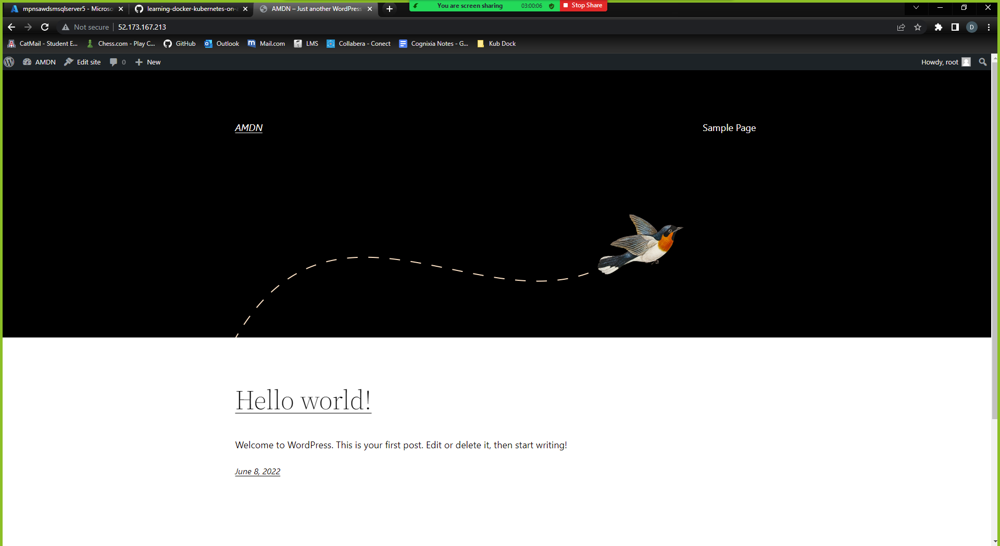

# scrum-agile-final-project

## Description
Hand-on practice coordinating an Agile project using Scrum practices. Deploys a wordpress site on an Azure virtual machine. Using Terraform for infrastructure provisioning,
Github as a code repo, Azure MySQL as a database, Azure Storage Account for file storage, and Azure Load Balancer to expose services.

Website hosted at <PublicIP>/wordpress
Example: 52.173.167.213/wordpress

## Table of Contents

- [Links](#links)
- [Installation](#installation)
- [Usage](#usage)
- [Screenshots](#screenshots)
- [License](#license)
- [Contributors](#contributors)

 ## Links
https://github.com/nschwenne/scrum-agile-final-project


 ## Installation
To install necessary dependencies, run the following command:

```
Please install the Azure CLI
https://docs.microsoft.com/en-us/cli/azure/

As well as Terraform
https://www.terraform.io/downloads
```

 ## Usage
 You will need a terraform.tfvars within the `terraform-manifests` directory with the following information
 ```
 azure_subscription_id = "<YOUR AZURE SUBSCRIPTION ID>"
 ```

 To apply this variable, you will need to call:
 ```
 var.azure_subscription_id
 ```

 Copy terraform-manifests folder into local directory
 Run these commands:
 ```
 cd terraform-manifests
 terraform init
 terraform validate
 terraform plan -out tfplan.out
 terraform apply tfplan.out
 ```

 ```
 mysql --host=mpnsawdsmsqlserver5.mysql.database.azure.com --user=dbadmin --password=4567secretPASS
 ```

 ## Screenshots
 
 


 ## License
This project is not licensed

 ## Contributors

[davids.developer@outlook.com](mailto:davids.developer@outlook.com)
Github Repo: [davidschepis](https://github.com/davidschepis).

[mike@phelpsweb.dev](mailto:mike@phelpsweb.dev)
Github Repo: [mphelps1978](https://github.com/mphelps1978).

[nschwenne@gmail.com](mailto:nschwenne@gmail.com)
Github Repo: [Nschwenne](https://github.com/Nschwenne).

[M.Andreas.Wall@proton.me](mailto:M.Andreas.Wall@proton.me)
Github Repo: [Andreas-Wall](https://github.com/Andreas-Wall).
